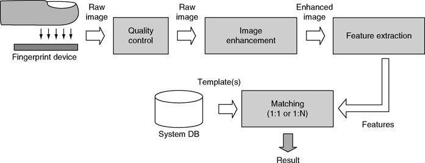
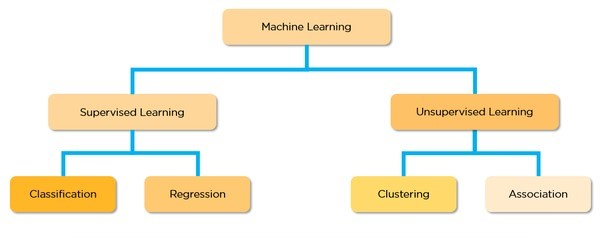
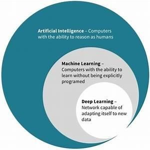
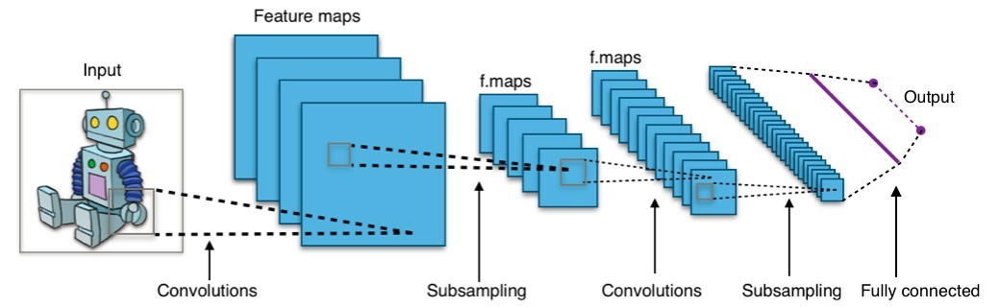
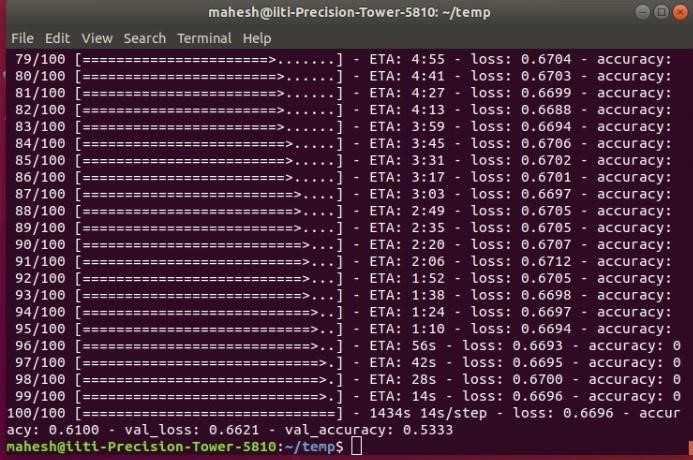

# CNN-Model-Detecting-Liveness-of-Fingerprint-using-Deep-Learnig-
## Abstract

This project is to design the Convolutional Neural Network (CNN) to detect Fake or Live fingerprints has been completed within a period of one month. First, a simple CNN model was built for a small dataset containing images of fingerprints. Then this model was modified for a larger dataset containing thousands of such fingerprint images. As both these approaches did not yield much accuracy, so other predefined architectures like the VGG16 were tried out. The VGG16 model did not improve the accuracy, and so the softmax activation function of the last layer of the VGG16 model was replaced with sigmoid. This improved the accuracy to some extent, but is still not an acceptable as the accuracy is below 80%.

#

## 1.Introduction

**1.1**** Why fingerprint?**

Fingerprints are one of the most widely used form of biometric identification, which leads other biometric identification methods like facial recognition, voice recognition, etc. The use of fingerprints as identifiers is perhaps one of the oldest and most familiar methods of identification.

Fingerprints are used as identifiers because their patterns remain fixed over time and are less liable to wearing and age. This stands in sharp contrast to other modes of identification such as faces and voice recognition, the latter being so malleable it can be changed temporarily even by illness.

**1.2**** How is Fingerprint Identification done?**

A fingerprint is acquired by a live-scan device which captures a digital image of the fingerprint. Most devices sample the image at 500 DPI (Dots per Inch) and produce an 8-bit gray-scale raw image. Some such devices also include mechanisms to distinguish between a fake and a live fingerprint to reveal spoofing attacks by fake fingerprints. The acquired raw image is then passed to a quality control module which checks whether the sample is good enough to be processed or not. If the quality is low then the system rejects the sample, otherwise it is passed to an image enhancement module whose main goal is to improve the clarity of the ridge pattern, especially in the noisy region and to simplify the subsequent feature extraction. The feature extraction module draws out a set of data (features) from the enhanced image. This feature set often includes minutiae points but, depending on the matching algorithm, other features (e.g., local orientation, local frequency, singularities, ridge shapes, ridge counts, parts of the improved image, etc.) may be extracted in conjunction with small details. Finally, the fingerprint matching module retrieves from a system database one or more templates and matches it with the features extracted from the current sample. If the system is operating in the verification mode where the user is required to claim his/her identity, only one template is retrieved from the database and matched with the current sample. On the other hand, if the system is operating in the identification mode where the identity of an individual is to be determined, the current sample is matched against all the database templates to check if one of them is sufficiently similar.

_Fig. 1.1 The block diagram of a fingerprint-based recognition system._

**1.3 What is Machine Learning?**

Machine learning is the scientific study of algorithms and statistical data that the computer systems (machine) use to progressively refines their performance on a specific problem. The algorithms build a mathematical model of sample data, called the &quot;training data&quot; to make predictions or decisions without being explicitly programmed to perform the task. That means the computer (machine) learns from the data by itself.

The types of Machine Learning Algorithms differ in their approach:

1. Supervised Learning
2. Unsupervised Learning

_Fig. 1.2 Categories of Machine Learning_

**1.3.1) Supervised Learning:** Machine Learning can be considered as a basic human nature. We learn from examples. In a supervised learning procedure, some labelled data are fed to the computer as examples. These input data are called training data. Each training example has a few inputs and a desired output.

Through iterative optimization of an objective function, a supervised learning algorithm learns

a function that can be used to predict the output associated with a new input which is not a part of the training data. It has two types:

**1.3.1.A) Regression:** A regression model is when the output is a continuous value, such as salary or weight. Many alternative models may be used, but the simplest is the statistical regression. It tries to suit data with the simplest hyper-plane which fits through the points. In simple language, the algorithm sets up a mathematical relation between the training data and the desired output. Then it predicts the output from a new input.

**1.3.1.B) Classification:** A classification model is when the output variable is a category, like &quot;red&quot; or &quot;blue&quot; or &quot;cat&quot; or &quot;dog&quot;. A classification model tries to draw conclusions from observed values. Given one or more inputs, the model will predict the value of one or more outcomes. Briefly, the classification model either predicts categorical class labels or classifies data based on the training set and values (class labels) in classifying attributes and uses it to classify new data.

**1.3.2) Unsupervised Learning:** Unsupervised Learning is the training of machine using information that is neither classified nor labeled and allowing the algorithm to work on that data without supervision. Here the machine groups the unsorted information according to similarities, patterns, and differences without any prior training of data. It is further classified as:

1. Clustering
2. Association

**1.4) What are Neural Networks?**

In the standard approach to programming, we tell the computer what to do, breaking big problems into many precise tasks that a computer can easily perform. Whereas, in a neural network, we do not tell the computer how to solve problems. Instead, it learns from observational data, figuring out its own solution to the problem at hand. Deep learning is a wellbuilt set of techniques for learning in neural networks.

Neural networks and deep learning presently provide the finest solutions to many problems in image recognition, speech recognition, and natural language processing.

_Fig. 1.3 Venn diagram representing the relationship among AI, ML, DL._

There are mainly two kinds of neural networks:

1. Convolutional Neural Network (CNN): Suitable for image recognition. 2. Long Short Term Memory Network: Suitable for speech recognition.

_Fig. 1.4 Working of a CNN model_

## 2.Proposed Model

Here we are going to design a neural network with image inputs of size(300x300). The network will be trained with a set of training images of fingerprints collected from different sensors. The data is collected in 2 sets of fake and live. The desired output, that is, whether the fingerprint is live or fake, is given by the trained network.

We will try to implement a SUPERVISED CLASSIFICATION learning model by using feedforward and backpropagation algorithm technique. Here we are going to use the KERAS library which is already written in python.

**2.1) Designing the Neural Network to Detect Liveness of Fingerprints:**

**2.2.1) Our Model:** First, we have taken a small dataset consisting of 98 samples (.png format fingerprint images) and tried building the CNN model with this dataset using Keras on Google Colab.

**Code:**

#importing the libraries

from keras.preprocessing.image import ImageDataGeneratorfrom keras.models import Model, Sequential #creating the architecture for the CNNfrom keras.layers import Dense, Conv2D, Flatten #creating layers for the modelimport numpy as npimport os #to access the data stored in the computerfrom PIL import Image, ImageFile

ImageFile.LOAD\_TRUNCATED\_IMAGES = True

#loading the dataset from Google Drivefrom google.colab import drive

drive .mount(&#39;/content/drive&#39;)

#Designing compiling the CNN modelmodel=Sequential()

model.add(Conv2D(32, kernel\_size=3, activation=&#39;relu&#39;, input\_shape=(300,300,3))) #input layermodel.add(Conv2D(32, kernel\_size=3, activation=&#39;relu&#39;)) #this is a convolution layermodel.add(Conv2D(64, kernel\_size=3, activation=&#39;relu&#39;)) #this is another convolution layermodel.add(Conv2D(64, kernel\_size=3, activation=&#39;relu&#39;)) #this is another convolution layermodel.add(Flatten()) #converts into 1-D array i.e. flattensmodel.add(Dense(1,activation=&#39;sigmoid&#39;)) #1 neurons. 2 diferent labels (Fake or Live)

model.compile(loss=&#39;binary\_crossentropy&#39;,optimizer=&#39;adam&#39;,metrics=[&#39;accuracy&#39;]) #compiling the model

#loading and classifying data into train and test setstrain\_datagen=ImageDataGenerator(rescale=-

1./255,shear\_range=0.1,zoom\_range=0.2,horizontal\_flip=False)test\_datagen=ImageDataGenerator(rescale=1./255)

train\_set=train\_datagen.flow\_from\_directory(&quot;/content/drive/My Drive/Deep Learning

IITI/Fingerprint/train&quot;,target\_size=(300,300),batch\_size=16,class\_mode=&#39;binary&#39;)test\_set=test\_datagen.flow\_from\_directory(&quot;/content/drive/My Drive/Deep Learning IITI/Fingerprint/test&quot;,target\_size=(300,300),batch\_size=16,class\_mode=&#39;binary&#39;)

#Fitting the model

model.fit\_generator(train\_set,steps\_per\_epoch=25,epochs=3,validation\_data=test\_set,validation\_steps=2)model.save\_weights(&#39;hi.h5&#39;) # to save weights after training

**Output:**

After this, we applied the CNN model to a bigger dataset consisting of 13,618 samples (.png format fingerprint images). The accuracy decreased as compared to the previous model. The output obtained is as shown below:

**2.2.2) VGG16 Model:** The VGG16 model is also known as the OxfordNet model. It is a convolutional neural network (CNN) architecture designed by the Visual Geometry Group from Oxford and hence, the name. The team used this model to win the ILSVR (ImageNet) competition in 2014. Till today this model is considered as one of the best vision models. However, some recent advances, such as the Inception model and the ResNet model, have outperformed the VGG16 model.

**Code:**

#importing the librariesimport keras,osfrom keras.models import Sequential,Model

from keras.layers import Dense, Conv2D, MaxPool2D,Flattenfrom keras.preprocessing.image import ImageDataGeneratorimport numpy as np

from PIL import Image, ImageFile

ImageFile.LOAD\_TRUNCATED\_IMAGES = True

#loading the dataset from Google Drivefrom google.colab import drive

drive .mount(&#39;/content/drive&#39;)

#loading and classifying data into train and test setstrain\_datagen=ImageDataGenerator(rescale=-

1./255,shear\_range=0.1,zoom\_range=0.2,horizontal\_flip=False)test\_datagen=ImageDataGenerator(rescale=1./255)train\_set=train\_datagen.flow\_from\_directory(&quot;/content/drive/My

Drive/MODEL1/Train&quot;,target\_size=(300,300),batch\_size=16,class\_mode=&#39;binary&#39;)test\_set=test\_datagen.flow\_from\_directory(&quot;/content/drive/My

Drive/MODEL1/Test&quot;,target\_size=(300,300),batch\_size=16,class\_mode=&#39;binary&#39;)

#Designing compiling the CNN modelmodel=Sequential()model.add(Conv2D(input\_shape=

(300,300,3),filters=64,kernel\_size=(3,3),padding=&#39;same&#39;,activation=&#39;relu&#39;))model.add(Conv2D(filters=64,kernel\_size=(3,3),padding=&#39;same&#39;,activation=&#39;relu&#39;))model.add(MaxPool2D(pool\_size=(2,2)))

model.add(Conv2D(filters=128,kernel\_size=(3,3),padding=&#39;same&#39;,activation=&#39;relu&#39;))model.add(Conv2D(filters=128,kernel\_size=(3,3),padding=&#39;same&#39;,activation=&#39;relu&#39;))model.add(MaxPool2D(pool\_size=(2,2)))

model.add(Conv2D(filters=256,kernel\_size=(3,3),padding=&#39;same&#39;,activation=&#39;relu&#39;))model.add(Conv2D(filters=256,kernel\_size=(3,3),padding=&#39;same&#39;,activation=&#39;relu&#39;))model.add(Conv2D(filters=256,kernel\_size=(3,3),padding=&#39;same&#39;,activation=&#39;relu&#39;))model.add(MaxPool2D(pool\_size=(2,2)))

model.add(Conv2D(filters=512,kernel\_size=(3,3),padding=&#39;same&#39;,activation=&#39;relu&#39;))model.add(Conv2D(filters=512,kernel\_size=(3,3),padding=&#39;same&#39;,activation=&#39;relu&#39;))model.add(Conv2D(filters=512,kernel\_size=(3,3),padding=&#39;same&#39;,activation=&#39;relu&#39;))model.add(MaxPool2D(pool\_size=(2,2)))

model.add(Flatten())

model.add(Dense(4096,activation=&#39;relu&#39;))model.add(Dense(4096,activation=&#39;relu&#39;))

model.add(Dense(1,activation=&#39;sigmoid&#39;))

model.compile(loss=&#39;binary\_crossentropy&#39;,optimizer=&#39;adam&#39;,metrics=[&#39;accuracy&#39;])

model.summary()

from keras.callbacks import ModelCheckpoint,EarlyStopping

checkpoint=ModelCheckpoint(&quot;vgg16\_1.h5&quot;,monitor=&#39;val\_acc&#39;,verbose=1,save\_best\_only=True)early=EarlyStopping(monitor=&#39;val\_acc&#39;,patience=20,verbose=1)

#fitting the model

model.fit\_generator(generator=train\_set,validation\_data=test\_set,steps\_per\_epoch=100,epochs=100,validati on\_steps=10,callbacks=[checkpoint,early])

**Output:**

## 3.Result

The convolutional neural network without using VGG16 showed a greater accuracy (73.29%) for a smaller dataset. When size of the dataset was increased, the accuracy came down to (60.75%). Therefore, to improve upon the accuracy, we used the predefined architecture VGG16. However, the accuracy decreased to 30%. Hence, to improve the accuracy we tried changing the softmax function of the last layer of the VGG16 model to sigmoid. This resulted in some improvement of the accuracy but it was not acceptable as the final accuracy was 61%.

Since the accuracy of the final model is not up to the mark, so at this stage, the model cannot be used for real-life applications. More research is needed to improve the accuracy of this model. Once an accuracy over 80% is reached, this model can be used for real-life applications. It can be used in fingerprint scanners to detect fake and live fingerprints and prevent access in case of a spoofing attack with fake fingerprints thus, help in keeping the system secure.
